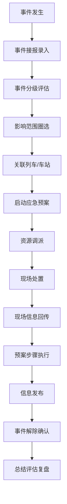

## 1. 产品概述

铁路应急指挥Web系统是面向路局应急值守人员的专业指挥平台，用于快速汇总灾害、故障和救援处置信息，实现应急事件的全流程可视化管理。

- 主要用途：铁路突发灾害、设备故障、安全事故的应急指挥与处置调度
- 目标用户：路局应急值守人员、指挥调度人员、现场救援人员
- 核心价值：缩短应急响应时间，提升处置效率，保障铁路运输安全

## 2. 核心功能

### 2.1 用户角色

| 角色 | 登录方式 | 核心权限 |
|------|----------|----------|
| 应急值守人员 | 账号密码登录 | 事件接报、信息查看、指令下达 |
| 指挥调度人员 | 账号密码登录 | 资源调派、预案执行、信息发布 |
| 系统管理员 | 账号密码登录 | 用户管理、系统配置、数据维护 |

### 2.2 功能模块

1. **态势总览**：全局态势地图、事件统计、实时告警、值班信息
2. **事件接报**：事件录入、分级管理、影响范围圈选、关联列车/车站
3. **资源调派**：救援队伍管理、物资位置查询、值班人员通知
4. **预案执行**：预案步骤勾选、时间线记录、指令回执
5. **现场回传**：现场图片上传、视频会商入口、位置定位
6. **信息发布**：对外通报草稿、旅客安置信息、解除确认
7. **总结评估**：复盘报告、演练记录、统计分析

### 2.3 页面详情

| 页面名称 | 模块名称 | 功能描述 |
|----------|----------|----------|
| 态势总览 | 全局地图 | 展示线路网、车站分布、事件位置、影响范围 |
| 态势总览 | 事件统计面板 | 按等级、类型、时间统计事件数量和趋势 |
| 态势总览 | 实时告警列表 | 展示最新告警事件，支持快速处理 |
| 态势总览 | 值班信息卡 | 当前值班人员、联系方式、交接班记录 |
| 事件接报 | 事件表单 | 事件类型、等级、时间、地点、描述录入 |
| 事件接报 | 影响范围圈选 | 地图圈选工具，计算影响范围和涉及车站 |
| 事件接报 | 列车关联 | 搜索并关联受影响的列车车次 |
| 事件接报 | 车站关联 | 选择受影响的车站和区间 |
| 资源调派 | 救援队伍列表 | 展示各救援队伍位置、状态、联系方式 |
| 资源调派 | 物资位置查询 | 查询应急物资分布和库存情况 |
| 资源调派 | 人员通知 | 一键通知值班人员和相关负责人 |
| 资源调派 | 调派记录 | 记录所有资源调派历史和状态 |
| 预案执行 | 预案选择 | 根据事件类型匹配并选择应急预案 |
| 预案执行 | 步骤勾选 | 逐条执行预案步骤，标记完成状态 |
| 预案执行 | 时间线记录 | 自动记录处置节点，生成时间线 |
| 预案执行 | 指令回执 | 下达处置指令并接收回执确认 |
| 现场回传 | 图片上传 | 现场照片批量上传、分类管理 |
| 现场回传 | 视频会商 | 视频会议入口、实时音视频通信 |
| 现场回传 | 位置定位 | 现场人员GPS定位、轨迹追踪 |
| 信息发布 | 通报草稿 | 对外通报内容编辑、审核、发布 |
| 信息发布 | 旅客安置 | 记录旅客疏散、安置、转运信息 |
| 信息发布 | 解除确认 | 事件解除条件确认、发布解除通知 |
| 总结评估 | 复盘报告 | 生成事件处置复盘报告 |
| 总结评估 | 演练记录 | 应急演练计划、执行、评估记录 |
| 总结评估 | 统计分析 | 多维度事件统计、趋势分析图表 |

## 3. 核心流程

## 4. 用户界面设计

### 4.1 设计风格

- **主色调**：深蓝色系（#165DFF 为主色），代表专业、可靠、安全
- **辅助色**：红色（#F53F3F）表示紧急/告警，绿色（#00B42A）表示正常/完成，橙色（#FF7D00）表示警告
- **按钮风格**：直角轻微圆角（4px），实心按钮配白色文字，轮廓按钮配边框
- **字体**：思源黑体（Source Han Sans）为主，标题18-20px，正文14px
- **布局风格**：左侧导航栏 + 顶部状态栏 + 主内容区，卡片式布局
- **图标风格**：线性图标，简洁现代，统一24px尺寸

### 4.2 页面设计概览

| 页面名称 | 模块名称 | UI元素 |
|----------|----------|--------|
| 态势总览 | 全局地图 | 全屏地图背景，事件标记点，影响范围热力圈 |
| 态势总览 | 统计卡片 | 数据卡片网格，数字动画，趋势小图表 |
| 事件接报 | 表单布局 | 左右分栏，左侧表单，右侧地图预览 |
| 资源调派 | 列表布局 | 表格列表 + 地图定位双视图切换 |
| 预案执行 | 时间线 | 垂直时间线，步骤卡片，状态标签 |
| 现场回传 | 图片墙 | 瀑布流图片网格，大图预览模态框 |
| 总结评估 | 图表区 | ECharts图表，柱状图、折线图、饼图组合 |

### 4.3 响应式设计

- 桌面优先设计，适配1920×1080及以上分辨率
- 支持平板设备横向浏览，关键功能可用
- 导航栏在小屏幕可折叠收起
- 表格在移动端支持横向滚动

### 4.4 数据可视化

- 地图使用：展示铁路线路、车站、事件位置、影响范围
- 图表类型：事件趋势折线图、等级分布饼图、类型统计柱状图
- 实时更新：关键数据每30秒自动刷新
- 交互效果：支持地图缩放、点击查看详情、图表钻取
