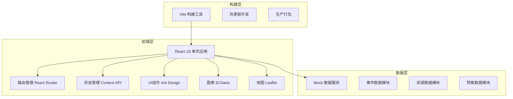
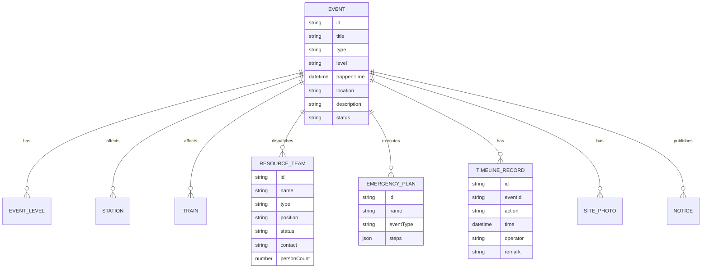

## 1. 架构设计



## 2. 技术选型说明

- **前端框架**: React@18 + TypeScript
- **构建工具**: Vite@5
- **路由管理**: React Router Dom@6
- **UI组件库**: Ant Design@5
- **图表库**: ECharts@5 + echarts-for-react
- **地图库**: Leaflet@1 + react-leaflet
- **样式方案**: TailwindCSS@3 + CSS Modules
- **图标**: @ant-design/icons + lucide-react
- **日期处理**: dayjs
- **数据模拟**: Mock 静态数据

## 3. 路由定义

| 路由路径 | 页面名称 | 功能说明 |
|----------|----------|----------|
| / | 态势总览 | 全局态势地图、事件统计、实时告警 |
| /event-report | 事件接报 | 事件录入、影响范围圈选、关联列车车站 |
| /resource-dispatch | 资源调派 | 救援队伍、物资查询、人员通知 |
| /plan-execute | 预案执行 | 预案步骤、时间线、指令回执 |
| /site-feedback | 现场回传 | 图片上传、视频会商、位置定位 |
| /info-publish | 信息发布 | 通报草稿、旅客安置、解除确认 |
| /summary | 总结评估 | 复盘报告、演练记录、统计分析 |

## 4. 目录结构

```
src/
├── components/          # 公共组件
│   ├── Layout/         # 布局组件
│   ├── Map/            # 地图相关组件
│   ├── Charts/         # 图表组件
│   └── Common/         # 通用UI组件
├── pages/              # 页面组件
│   ├── Dashboard/      # 态势总览
│   ├── EventReport/    # 事件接报
│   ├── ResourceDispatch/# 资源调派
│   ├── PlanExecute/    # 预案执行
│   ├── SiteFeedback/   # 现场回传
│   ├── InfoPublish/    # 信息发布
│   └── Summary/        # 总结评估
├── types/              # TypeScript类型定义
├── mock/               # Mock数据
├── utils/              # 工具函数
├── hooks/              # 自定义Hooks
├── styles/             # 全局样式
├── router/             # 路由配置
├── App.tsx
└── main.tsx
```

## 5. 核心数据模型



## 6. 核心组件设计

### 6.1 布局组件 Layout
- 左侧固定导航栏（240px宽）
- 顶部状态栏（高度64px）
- 主内容区域自适应
- 支持导航折叠

### 6.2 地图组件 EventMap
- 基于Leaflet实现
- 支持铁路线路绘制
- 事件标记点聚类
- 影响范围圈选工具
- 车站、列车位置展示

### 6.3 时间线组件 Timeline
- 垂直时间线展示
- 支持事件节点添加
- 状态标签颜色区分
- 时间自动记录

### 6.4 统计卡片组件 StatCard
- 数字动画效果
- 趋势小图展示
- 状态颜色区分
- 点击跳转详情
